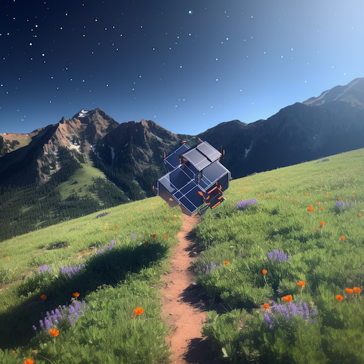

Friends,

We are building a new sort of alt-geo event. We'd like to get an early gauge of interest in participating. SatCamp will be held in the woods outside Boulder on Sept 12-14. We intend to keep this first event to around 60 people. SatCamp is all about collaboration and community. It's about helping each other be successful. A tight set of sessions will create spaces where people can be candid about challenges and opportunities, constructively explore differences of opinion, and safely share failures. The majority of time we will be connecting and scheming along Boulder's hiking/biking trails, climbing routes or coffee/brewery spots. Everyone who shows up to SatCamp is expected to contribute. You might lead a discussion or a yoga session.

If this sounds interesting to you, let us know by filling out [this form](https://docs.google.com/forms/d/e/1FAIpQLSfLAQx_7zHfM0F2yIt1Qbkq0NI0BdXly5mbH_vIk22NB_yEPA/viewform?pli=1).