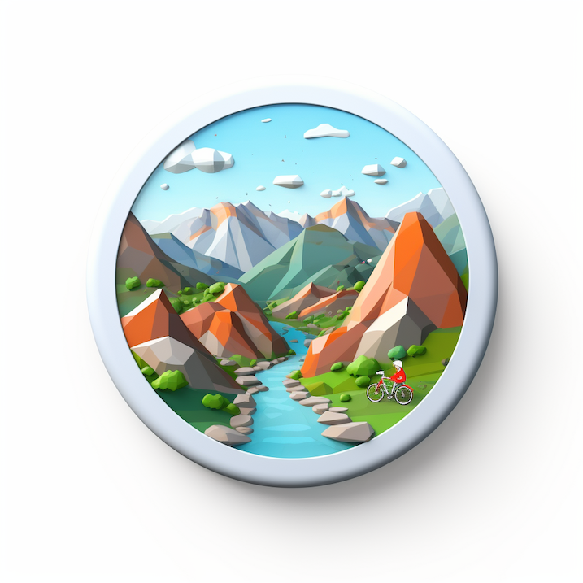

SatCamp is a new geospatial event that will allow for more meaningful conversations, connections, and collaboration.

Registration is expected to open in July.

**When:** September 12th-14th, 2023

**Where:** Boulder, Colorado, USA

**What:** Conversations while hiking, biking, climbing, running, and caffeinating!

See you outside!
